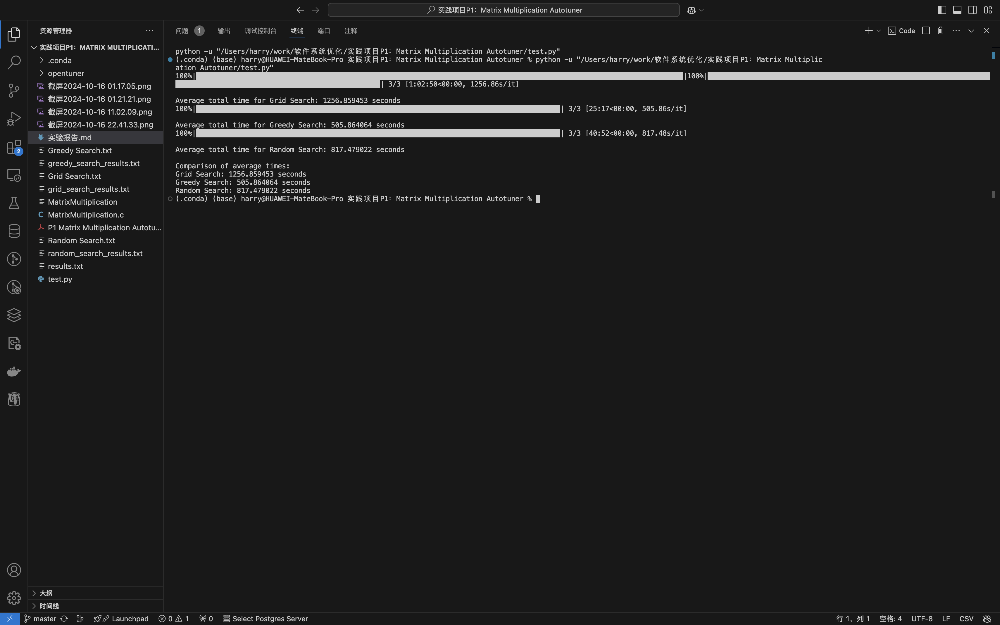
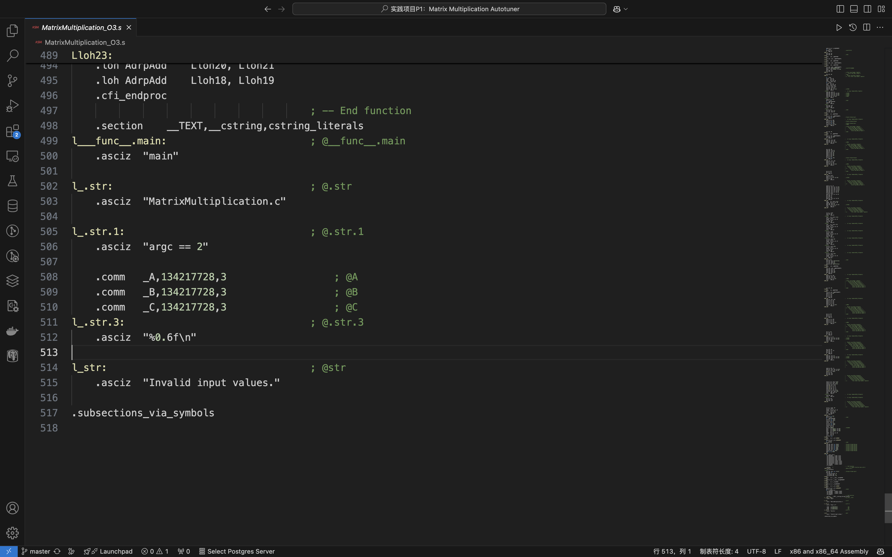

# 实践项目P1：Matrix MultiplicationAutotuner 实验报告

## 实验要求

本次实验需要我们设计和实现一个程序性能的自动调优器Autotuner，可以自动测试Matrix Multiplication
程序的可配置参数，并根据性能选择最优配置输出。
给到的参数共有两项
- 循环分块大小：测试循环分块大小s 为 8, 16, 32, 64, 128 五种情况。
- 编译优化级别：测试 O0, O1, O2, O3 四种级别。

## Matrix Multiplication代码分析
```c
#include <stdlib.h>
#include <stdio.h>
#include <sys/time.h>
#include <assert.h>

#define n 4096
double A[n][n];
double B[n][n];
double C[n][n];

float tdiff(struct timeval *start, struct timeval *end)
{
    return (end->tv_sec - start->tv_sec) + 1e-6 * (end->tv_usec - start->tv_usec);
}

int main(int argc, const char *argv[])
{
    assert(argc == 2);
    int s = atoi(argv[1]);
    if (s < 1 || s > 4096)
    {
        printf("Invalid input values.\n");
        return -1;
    }

    // 初始化矩阵 A 和 B
    for (int i = 0; i < n; ++i)
    {
        for (int j = 0; j < n; ++j)
        {
            A[i][j] = (double)rand() / (double)RAND_MAX;
            B[i][j] = (double)rand() / (double)RAND_MAX;
            C[i][j] = 0;
        }
    }

    struct timeval start, end;
    gettimeofday(&start, NULL);

    // 矩阵乘法（分块）
    for (int ih = 0; ih < n; ih += s)
        for (int jh = 0; jh < n; jh += s)
            for (int kh = 0; kh < n; kh += s)
                for (int il = 0; il < s; ++il)
                    for (int kl = 0; kl < s; ++kl)
                        for (int jl = 0; jl < s; ++jl)
                            C[ih + il][jh + jl] += A[ih + il][kh + kl] * B[kh + kl][jh + jl];

    gettimeofday(&end, NULL);

    // 输出运行时间
    printf("%0.6f\n", tdiff(&start, &end));
    return 0;
}
```
我们可以看到，实验提供给我们的矩阵乘法代码可以随机化矩阵A和B并通过给定的分块参数对矩阵进行分块乘法，最后返回计算的时间

## Autotuner设计

### 参数测试函数——compile_and_run_matrix_multiplication函数
首先我们需要设计一个函数可以对于我们给定的优化等级对MatrixMultiplication的代码进行编译生成和运行可执行文件，这里我们采用`subprocess`库来进行
```python
def compile_and_run_matrix_multiplication(source_file, optimization_level, block_size):
    executable = f'./matrix_mult_{optimization_level}'
    compile_command = ['gcc', source_file, '-o', executable, f'-O{optimization_level}']
    subprocess.run(compile_command, check=True)

    result = subprocess.run([executable, str(block_size)], capture_output=True, text=True)
    try:
        return float(result.stdout.strip())
    except ValueError:
        print(f"Invalid output from {executable} for block size {block_size}: {result.stdout.strip()}")
        return float('inf')
    finally:
        os.remove(executable)
```
我们将输入的优化等级参数用于编译，并将块大小`block_size`作为参数输入并运行可执行文件，并将`MatrixMultiplication`返回的计算时间作为结果返回，最后删除可执行文件，完成一次完整的参数测试。

### 结果存储函数——log_experiment_results函数
我们需要一个函数来帮我们把每次计算的结果存储，方法很简单，打开文件写入即可
```python
def log_experiment_results(filename, block_size, optimization_level, time_taken):
    with open(filename, "a") as f:
        f.write(f"Block size: {block_size}, Optimization level: {optimization_level}, Time: {time_taken}\n")

```

### 搜索函数的构建

#### 网格搜索
网格搜索顾名思义，即对所有的参数组合进行一一的匹配遍历搜索，搜索的过程中记录最优解
我们首先初始化变量，将最初的最佳时间赋予一个极大值，并开始记录时间
我们利用两层循环对所有的参数组合进行遍历，将得到的结果存储
最终返回我们得到的最佳配置和时间
```python
def grid_search(source_file, optimization_levels, block_sizes):
    best_time = float('inf')
    best_block_size = None
    best_optimization_level = None
    start_time = time.time()

    for opt_level in optimization_levels:
        for s in block_sizes:
            time_taken = compile_and_run_matrix_multiplication(source_file, opt_level, s)
            log_experiment_results("grid_search_results.txt", s, opt_level, time_taken)
            if np.isinf(time_taken):
                continue
            if time_taken < best_time:
                best_time = time_taken
                best_block_size = s
                best_optimization_level = opt_level

    elapsed_time = time.time() - start_time
    return best_block_size, best_optimization_level, best_time, elapsed_time
```

#### 随机搜索
随机搜索，即随机选择参数进行测试，并选取最优的结果，具体流程和网格搜索类似，仅进行测试的参数配置更少了
这里我们为了进行参数的随机选择，我们采用了`itertools`库将获得两个参数的所有组合，并从中随机选择
```python
def random_search(source_file, optimization_levels, block_sizes, K):
    best_time = float('inf')
    best_block_size = None
    best_optimization_level = None
    random.seed(36)
    start_time = time.time()

    all_combinations = list(itertools.product(optimization_levels, block_sizes))
    random_combinations = random.sample(all_combinations, K)

    for (random_optimization_level, random_block_size) in random_combinations:
        time_taken = compile_and_run_matrix_multiplication(source_file, random_optimization_level, random_block_size)
        log_experiment_results("random_search_results.txt", random_block_size, random_optimization_level, time_taken)
        if np.isinf(time_taken):
            continue
        if time_taken < best_time:
            best_time = time_taken
            best_block_size = random_block_size
            best_optimization_level = random_optimization_level

    elapsed_time = time.time() - start_time
    return best_block_size, best_optimization_level, best_time, elapsed_time

```

#### 贪心搜索
对于这个任务的贪心搜索，我采用了先对于给定一个随机块大小进行优化参数的搜索，再根据最佳的优化等级来寻找块大小。其他部分基本和前面的算法一致
这样得到的结果是一个局部最优解，不一定是最优解，但是计算的工作量被大大减小
```python
def greedy_search(source_file, optimization_levels, block_sizes):
    best_time = float('inf')
    best_block_size = None
    best_optimization_level = None
    start_time = time.time()

    for opt in optimization_levels:
        s = block_sizes[0]
        time_taken = compile_and_run_matrix_multiplication(source_file, opt, s)
        log_experiment_results("greedy_search_results.txt", s, opt, time_taken)
        if np.isinf(time_taken):
            continue
        if time_taken < best_time:
            best_time = time_taken
            best_block_size = s
            best_optimization_level = opt
    
    for s in block_sizes:
        time_taken = compile_and_run_matrix_multiplication(source_file, best_optimization_level, s)
        log_experiment_results("greedy_search_results.txt", s, best_optimization_level, time_taken)
        if np.isinf(time_taken):
            continue
        if time_taken < best_time:
            best_time = time_taken
            best_block_size = s

    elapsed_time = time.time() - start_time
    return best_block_size, best_optimization_level, best_time, elapsed_time
```
### 测试函数构建
我们设计一测试函数，用于统一进行测试
```python
def run_experiments(source_file,algorithms, optimization_levels, block_sizes, num_trials=5):
    
    avg_times = {}
    
    for algo_name, algo_func in algorithms.items():
        times = []
        best_block_sizes = []
        best_optimization_levels = []
        best_times = []
        for _ in tqdm(range(num_trials)):
            best_block_size, best_optimization_level, best_time, elapsed_time = algo_func(source_file, optimization_levels, block_sizes)
            best_block_sizes.append(best_block_size)
            best_optimization_levels.append(best_optimization_level)
            best_times.append(best_time)
            times.append(elapsed_time)
        avg_times[algo_name] = np.mean(times)
        print(f"\nAverage total time for {algo_name}: {avg_times[algo_name]:.6f} seconds")
        with open(f"BestResults\{algo_name}.txt", "w") as f:
            for i in range(num_trials):
                f.write(f"Block size: {best_block_sizes[i]}, Optimization level: {best_optimization_levels[i]}, Time: {best_times[i]}\n")

    return avg_times
```
### 程序接口
我们使用`argparse`库来处理命令行参数，实现了要求的三个接口：
- 输入的目标程序
- 输入的配置参数值组合
- 输入的参数值搜索算法。
```python
if __name__ == "__main__":
    parser = argparse.ArgumentParser(description="Matrix Multiplication Optimization Experiment")
    parser.add_argument('--source_file', type=str, default='MatrixMultiplication.c', help='Path to the source file.')
    parser.add_argument('--optimization_levels', type=int, nargs='+', default=[0, 1, 2, 3], help='List of optimization levels.')
    parser.add_argument('--block_sizes', type=int, nargs='+', default=[8, 16, 32, 64, 128], help='List of block sizes.')
    parser.add_argument('--num_trials', type=int, default=10, help='Number of trials for each algorithm.')

    args = parser.parse_args()

    algorithms = {
        'Grid Search': grid_search,
        'Greedy Search': greedy_search,
        'Random Search': lambda s, o, b: random_search(s, o, b, K=10),
    }

    avg_times = run_experiments(args.source_file, algorithms, args.optimization_levels, args.block_sizes, args.num_trials)

    print("\nComparison of average times:")
    for algo_name, avg_time in avg_times.items():
        print(f"{algo_name}: {avg_time:.6f} seconds")
```
## 实验结果与分析
最终我们完成了运行，得到了结果
三种搜索的耗时分别为
- 网格搜索：1256.859453 s
- 贪心搜索： 505.864064 s
- 随机搜索： 817.479022 s

下面进行分析

### 网格搜索 1256.859453 s
首先我们看到网格搜索的结果，因为网格搜索是最全面的，可以很好地帮助我们来对于该优化任务的整体结果进行分析，下图展示了我们得到的数据结果


纯数据不是很直观，我们将多轮的结果取均值并绘制图表


这样我们通过网格搜索得到了在我的电脑上运行不同配置的矩阵乘法耗时的时间表
我们观察表格可以发现，最优的配置是优化等级为`O2`，块大小为`128`，平均耗时为`13.54s`

#### Block Size
我们首先分析块大小的影响
矩阵的分块乘法的源代码中，我们可以发现改算法是对于A矩阵沿着行取块，对于B矩阵沿着列取块，由于整个矩阵的大小为
\[
    8*4096*4096\div1024\div1024=128MB
\]
显然对于三个这样大小的矩阵，是无法直接整个存入缓存的，因此每次换块都需要重新从内存中取，而分块的意义就在于此，即减少对于内存的访问
我们通过指令查看电脑的CPU缓存信息

我们可以看到
L1 缓存：
- hw.l1icachesize: 131072 (即 L1 指令缓存大小为 128 KB)
- hw.l1dcachesize: 65536 (即 L1 数据缓存大小为 64 KB)

L2 缓存：
- hw.l2cachesize: 4194304 (即 L2 缓存大小为 4 MB)

对于较小的块，很难充分利用L1缓存和L2缓存
我们可以计算一下，对于128的块大小而言，单个的块的占用的空间为
\[
8*128*128\div1024\div1024=0.125MB    
\]
同时我们需要知道的是，对于每一个分块的计算，B矩阵的分块是按列进行运算的，而二维数组在内存中是按行连续存储的，因此我们需要合适的块大小来契合缓存的逻辑，尽可能减少使得在访问数据时从内存中读取的次数。
通过实验我们得到了这个块大小为128.

#### 优化等级
-O0：无优化，编译器仅进行基本的语法检查和生成目标代码
-O1：进行基本的优化，包括消除死代码和简单的控制流优化
-O2：进行更多的优化，如循环展开、常量合并、内联扩展等
-O3：在-O2的基础上增加更激进的优化，如矢量化和更复杂的循环优化

通过网格搜索的结果，我们可以发现在块大小大于16后O2以微弱的优势优于O3，这说明在这个例子中O3对比于O2的优化效果不佳，甚至有所倒退，可能的原因之一是代码膨胀，指令提取效率降低。CPU在执行指令时需要提取指令流。如果代码变得庞大，提取指令的效率可能下降，因为提取和解码指令需要更多的时间和资源。
验证方式我们可以查看汇编代码，左为O2右为O3
{width=50%}{width=50%}
可以发现O2优化的代码为361行，O3优化的代码为517行，代码体积确实变大了。

同时原因也可能有优化过于激进等。

#### 配置结果
我们回看配置的数据表，我们可以计算相对增量百分比，具体计算公式为
\[
    Percent=[Time_{opt,bsize}-Min(Time)]*100%
\]
得到如下结果

这里我将右下角四个配置定义为可接受的优秀配置，O2 128是最优配置，接下来我们就可以借此对另外两个算法进行分析

### 随机搜索 817.479022 s
随机搜索是取$K$个配置进行搜索，实验中我们取$K=10$
我们首先计算得到最优配置的概率
\[
P_{\text{最优}}=1-\frac{C^1_{19}}{C^{10}_{20}}=0.5
\]
我们计算可得取到最优配置的概率是50%

对于优秀配置而言
\[
P_{\text{优秀}}=1-\frac{C^1_{16}}{C^{10}_{20}}=0.83
\]
可以看到我们取到优秀配置的概率为0.83%，注意优秀配置包含了最优配置
同时我们可以计算得到随机搜索相较于网格搜索减少了约为35%的耗时。
最终我们可以得到结论，在$K=10$的情况下，随机搜索耗时相较于网格搜索减少35%，得到优秀解的概率为83%，得到最优解的概率为50%。

### 贪心搜索 505.864064 s
贪心搜索是针对于本次实验的矩阵运算参数的特点来设置的，我们可以发现，在不同的块大小下，优化等级的变化对于时间的影响有着很强的一致性。
如果我们初始的块大小随机到8或者16，我们最终的结果只会得到优秀配置 opt 3 blsize 128 反之则得到最优解。本次我们只运行了三轮，得到的最优配置结果如下

我们来计算一下概率
\[
P_{\text{最优}}=\frac{3}{5}=0.6
\]
\[
P_{\text{优秀}}=\frac{3+2}{5}=1
\]
我们可以发现我们得到最优配置的概率是60%，优秀配置的概率是100%，时间缩短了约60%
虽然贪心得到了非常好的效果，但是其本身的局限性非常大，因此在我看来，从通用性的角度而言，这不是一个优秀的算法。

## 总结
本次实验我利用三种算法进行了矩阵乘法分块计算的配置的搜索，设计并实现了这三种算法，完成了对于算法以及结果的分析