 # 1. 软件系统优化作业1

## 1.1常用工具命令操作练习

### 1.1.1 uname -a

a）
1. **操作系统名称**: Linux
2. **主机名**: harry-virtual-machine
3. **内核版本**: 6.8.0-40-generic
4. **内核版本附加信息**: #40~22.04.3-Ubuntu SMP PREEMPT_DYNAMIC (表示系统是Ubuntu 22.04的一个版本)
5. **内核编译时间**: Tue Jul 30 17:30:19 UTC
6. **架构信息**:
   - **平台架构**: x86_64 (表示64位系统)
   - **处理器架构**: x86_64
7. **操作系统类型**: GNU/Linux

b）
1. **内核版本**（Kernel Version）：
   - 内核版本是指当前运行的 Linux 内核的版本号。它通常以三部分（主版本号.次版本号.修订号）表示，例如 `6.8.0`。而我在上一问中得到的虚拟机的内核版本是`6.8.0-40-generic`，这表示该版本的主版本号是*6*，次版本号是*8*，修订号是*0*，是第*40*次打包的版本，同时*generic*表示这是为大多数硬件通用设计的内核版本，其他后缀例如*- lowlatency*表示低延迟场景的内核版本，*- server*为服务器定制的内核版本。
2. **指令集架构**（Instruction Set Architecture, ISA）：
   - 指令集架构是 CPU 使用的机器语言标准，定义了 CPU 能够执行的指令集类型。常见的指令集架构包括 x86、x86_64、ARM、PowerPC 等。

### 1.1.2 sysctl -a
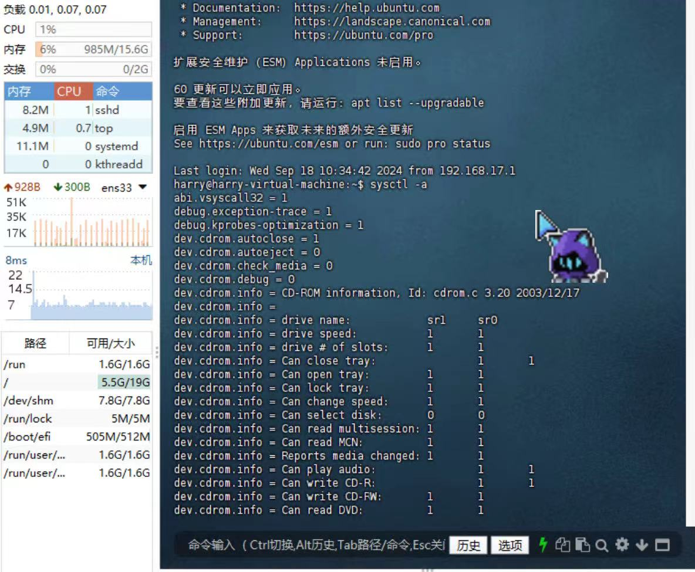
a）
`sysctl`是一个用于查看和修改Linux内核参数的工具，参数`-a`表示显示所有，连起来则表示显示所有可以通过`sysctl`修改的内核参数。

b）
输出的参数可以在`/proc/sys/`目录下找到。其中，`/proc/sys/`下的文件包含了内核中可修改的参数，我们可以通过`sysctl`来进行快速的修改，也可以通过直接修改文件内容来进行修改。

### 1.1.3 top

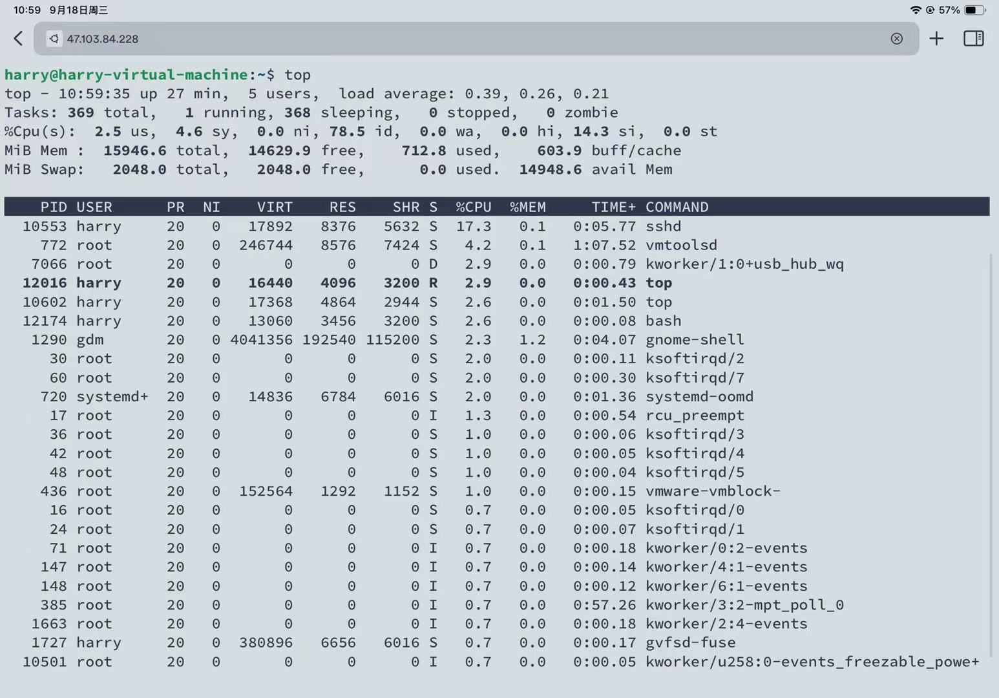

a）

我们输入top后，可以看到，第一行显示了时间、用户数量和系统负载`load average`，其中系统负载后的三个数字表示在过去1、5、15分钟的平均负载。

第二行展示了任务总数与各种状态的任务数量，包括*1*个运行中的、*368*个休眠的、*0*个停止的和*0*个僵死的。

第三行表示了CPU使用率，后面跟着各个部分的占比
- `2.5 us`表示用户空间占2.5%
- `4.6 sy`表示系统空间占4.6% 
- `0.0 ni`表示nice值调整的进程占用0.0%
- `95.0 id`表示CPU 有 95.0% 的时间处于空闲状态
- `1.2 wa`表示CPU 有 1.2% 的时间在等待 I/O 操作完成
- `0.1 hi`表示硬件中断占用了 0.1% 的 CPU 时间
- `0.2 si`表示软件中断占用了 0.2% 的 CPU 时间
- `0.0 st`表示虚拟机中虚拟 CPU 被其他虚拟机占用的时间为 0.0%。

第四行显示了内存的使用情况
- `15946.6 total` 总共 15946.6 MiB 的内存。
- `14629.9 free` 14629.9 MiB 是空闲的。
- `712.8 used` 已使用的内存为 712.8 MiB。
- `603.9 buff/cache` 系统缓冲区和缓存占用 603.9 MiB。

第五行开始显示的是进程表，各列的含义如下
- `PID` 进程 ID
- `USER` 进程所属的用户
- `PR` 进程优先级
- `NI` 进程的 nice 值
- `VIRT` 进程使用的虚拟内存大小
- `RES` 进程实际使用的物理内存大小
- `SHR` 进程使用的共享内存大小
- `S` 进程状态，`S` 表示休眠（sleeping），`R` 表示运行（running），`Z` 表示僵尸进程（zombie）
- `%CPU` 进程占用的 CPU 百分比
- `%MEM` 进程占用的内存百分比
- `TIME+` 进程启动以来累计的 CPU 时间
- `COMMAND` 运行的命令或进程名

### 1.1.4 dmidecode

a）`dmidecode` 用于从计算机的 DMI（Desktop Management Interface）表中提取硬件信息。

b)

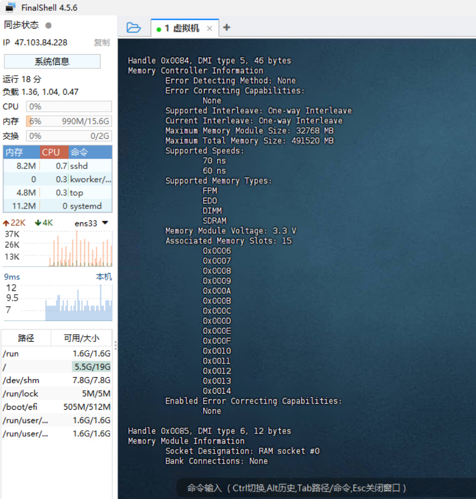

从截图中，可以看到使用 `dmidecode` 命令获取到的内存信息。

**Memory Controller Information**
  - **Error Detecting Method**: None，表示没有启用错误检测方法。
  - **Error Correcting Capabilities**: None，说明没有错误校正功能。
  - **Supported Interleave：One-way Interleave**: 表示当前使用的是单通道交叉存取。
  - **Maximum Memory Module Size**: 32768 MB，表示单个内存模块的最大容量是32 GB。
  - **Maximum Total Memory Size**: 491520 MB，系统最大支持内存容量是480 GB。
  - **Memory Types Supported**: 表示支持的内存形式，包括`FPM`、`EDO`、`Parity`、`SDRAM`
  - **Supported Speeds: 70ns 60ns** 内存的访问速度，以纳秒（ns）为单位。70ns和60ns表示内存模块在读取或写入数据时的延迟时间，较低的数值意味着更快的访问速度。60ns 比 70ns 更快，通常表示支持不同速度的模块。
  - **Memory Module Voltage: 3.3v** 这表示内存模块工作时所需的电压。3.3伏特（V）是标准的工作电压，用于确保内存模块稳定运行。
  - **Associated Memory Slots: 15** 这表明系统中有15个与此内存模块关联的插槽（可能是物理插槽或逻辑关联），这些插槽可用于安装内存模块。
  - **Enabled Error Correcting Capabilities  : None** 这表示内存模块没有启用错误校正功能（如ECC，即Error-Correcting Code）。ECC内存可以检测和修正内存中的数据错误，通常用于服务器或需要高稳定性的系统。
  
### 1.1.5 numactl -H

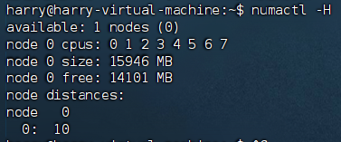

a) numactl -H 命令的 -H 选项用于显示 NUMA 系统的拓扑信息。具体来说，这个命令展示了系统中的 NUMA 节点数量、每个节点的 CPU 核心编号、每个节点的内存大小以及可用内存量。

b) 从输出结果 “available: 1 nodes (0)” 可以看出，系统中有 1 个 NUMA 节点，编号为 0。这个节点包含了编号为 0 到 7 的 CPU 核心，总内存大小为 15946 MB，当前可用内存为 14101 MB。节点距离矩阵显示了节点 0 到它自己的距离为 10（通常距离为 10 表示同一个节点，这是距离矩阵的默认表示方式）。

### 1.1.6 lscpu 与 $cat /proc/cpuinfo

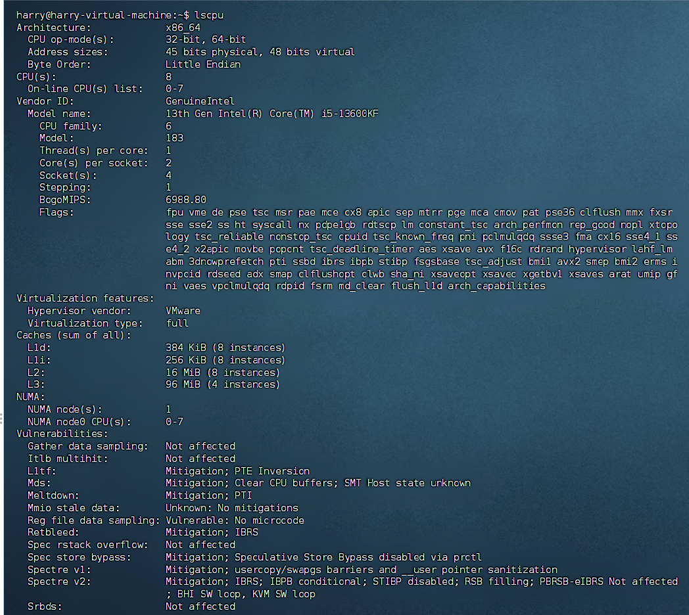

a) 从图中我们可以看到，通过lscpu，我们得到如下信息

- 系统架构（Architecture）
- CPU操作模式（CPU op-mode(s)）
- 地址大小（Address sizes）
- 字节序（Byte Order）
- 在线CPU数量（CPU(s)）
- 在线CPU列表（On-line CPU(s) list）
- 厂商ID（Vendor ID）
- CPU模型名称（Model name）
- CPU家族（CPU family）
- 模型（Model）
- 每个核心的线程数（Thread(s) per core）
- 每个插槽的核心数（Core(s) per socket）
- 插槽数量（Socket(s)）
- 步进（Stepping）
- 伪MIPS（BogoMIPS）
- CPU标志（Flags）
- 虚拟化功能（Virtualization features）
- 各级缓存大小（Caches）
- NUMA节点信息（NUMA）
- 安全漏洞信息（Vulnerabilities）

b) 
我们来运行一下 `cat /proc/cpuinfo`，得到如下结果
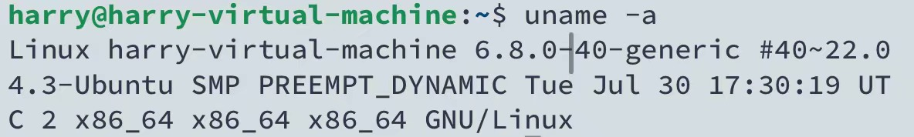
结合`lscpu`我们可以发现，该虚拟机显示的CPU型号为`13th Gen Intel® Core™ i5-13600KF`，总共有 8 个物理核心（每个插槽 2 个核心，共 4 个插槽），每个核心的线程数为 1，这表明没有启用硬件线程（超线程），因此物理核心数与线程数相同。但这里的CPU参数是虚拟的，真实的13600kf参数如下
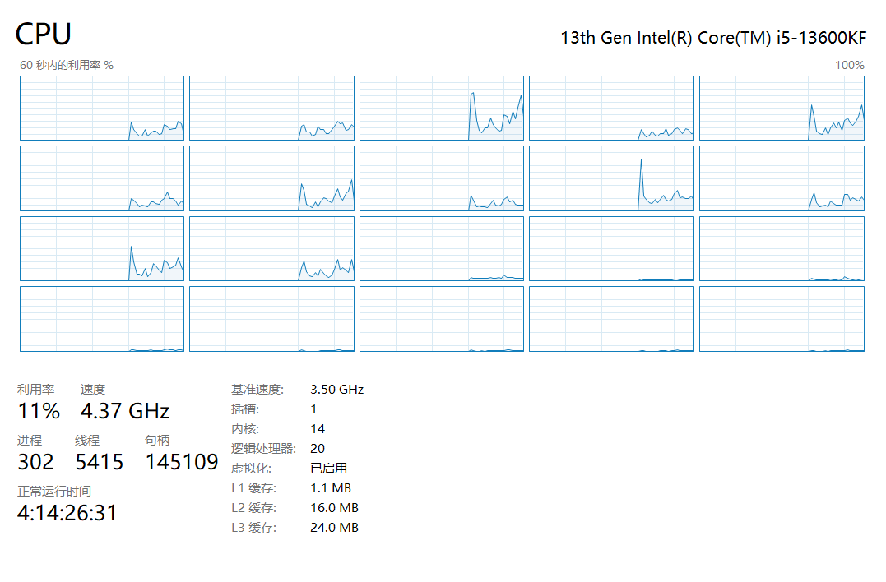

C)简要比较 lscpu 与 cat /proc/cpuinfo：

lscpu：
  - 提供一个简洁的、格式化的概览，易于理解系统的CPU拓扑。
  - 侧重于提供系统层面的CPU配置和拓扑结构信息。
  - 输出信息被汇总和分组，便于快速查看。
  
cat /proc/cpuinfo：
  - 显示每个CPU核心的详细信息，每个核心的信息单独列出。
  - 提供更详细的信息，如每个核心的时钟速度、缓存大小等。
  - 输出是文本格式，可能需要解析来获取特定信息。
  
### 1.1.7 free 

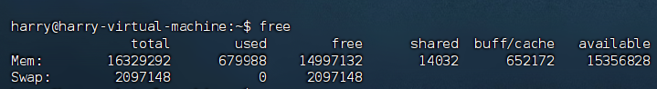

a)
物理内存（Mem）行：
- total：总内存量为 16329292 KiB
- used：已使用的内存量为 679988 KiB
- free：空闲的内存量为 14997132 KiB
- shared：共享内存量为 14032 KiB
- buff/cache：缓冲区和缓存的总和为 652172 KiB
- available：可用的内存总量为 15356828 KiB
  
交换空间（Swap）行：
- total：交换空间总大小为 2097148 KiB
- used：已使用的交换空间为 0 KiB
- free：空闲的交换空间为 2097148 KiB

b) 
这些数据是以千字节（KiB）为单位的。KiB 表示 1024 字节，而不是通常的 1000 字节（KB）。

### 1.1.8 vmstat 1

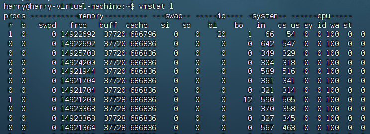
vmstat 1 是一个在Linux系统中用来显示虚拟内存统计信息的命令。该命令会以指定的间隔（这里是 1 秒）持续输出系统的虚拟内存、进程、CPU活动等统计信息。

`procs`：
- r：等待运行的进程数。
- b：等待I/O的进程数。
  
`memory`：
  - swpd：使用的虚拟内存量（单位：KB）
  - free：空闲的内存量（单位：KB）
  - buff：用作缓冲区的内存量（单位：KB）
  - cache：用作高速缓存的内存量（单位：KB）

`swap`：
  - si：从交换区到内存的交换速率（每秒KB）
  - so：从内存到交换区的交换速率（每秒KB）

`io`：
  - bi：从块设备接收的块（读）（每秒块数）
  - bo：发送到块设备的块（写）（每秒块数）

`system`：
  - in：每秒的中断数，包括时钟中断
  - cs：每秒的上下文切换数

`cpu`：
  - us：用户空间占用CPU时间的百分比
  - sy：系统空间占用CPU时间的百分比
  - id：CPU空闲时间的百分比
  - wa：等待I/O的CPU时间百分比
  - st：被虚拟机偷走的CPU时间百分比（仅虚拟化环境中显示）

### 1.1.9 mpstat -P ALL 1

mpstat -P ALL 1 是一个在Linux系统中用来监视所有CPU的处理器相关统计信息的命令。下面是对这个命令的分析。

`mpstat`：命令名称，用于报告处理器相关的统计信息。
`-P ALL`：选项 -P 后跟 ALL 表示显示所有CPU的统计信息。如果你指定一个CPU编号，它只会显示那个特定CPU的信息。
`1`：数字 1 表示报告的间隔时间，这里是每秒报告一次。

虚拟机中运行得到如下结果
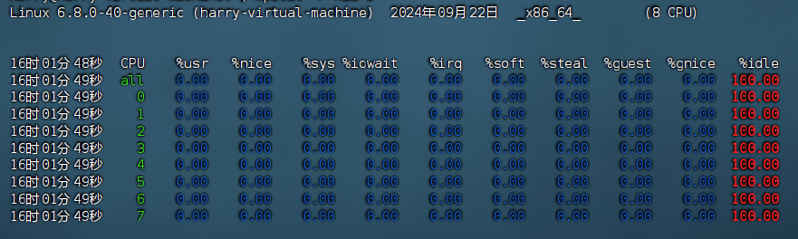

输出结果显示了在指定时间间隔（这里是每秒）内，系统上每个CPU核心的利用率统计信息。以下是输出内容的详细解释：

第一行显示了命令执行的时间戳，这里是 16时01分48秒。
接下来的行显示了所有CPU（标记为 all）和每个单独CPU核心（标记为从 0 到 7 的数字）的统计信息。

对于每个CPU核心，以下列出了各项统计数据的含义：

- %usr：用户级别的CPU时间百分比。
- %nice：在用户级别上，具有调整过优先级的进程所使用的CPU时间百分比。
- %sys：系统级别的CPU时间百分比。
- %iowait：CPU等待I/O操作完成的时间百分比。
- %irq：处理硬件中断的CPU时间百分比。
- %soft：处理软件中断的CPU时间百分比。
- %steal：在虚拟化环境中，当 hypervisor 为另一个虚拟处理器提供服务而造成的CPU时间损失百分比。
- %guest：运行虚拟处理器时CPU时间的百分比。
- %gnice：运行具有调整过优先级的虚拟处理器时CPU时间的百分比。
- %idle：CPU空闲时间的百分比。

### 1.1.10 pidstat 1

pidstat 1 是一个在Linux系统中用来监视单个进程或所有进程的CPU、内存、I/O和任务切换等统计信息的命令。同样这里的`1`表示每1秒报告一次。

运行得到如下结果
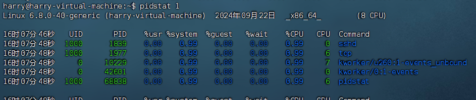
各项参数的含义与前面的命令基本一致。

### 1.1.11 iostat -xz 1
运行结果如下

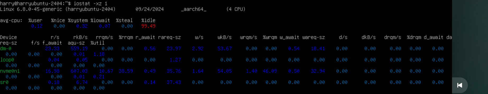

iostat 输出显示了系统和设备级别的I/O统计信息。

第一行为CPU使用情况
- `%user`: 0.12 – CPU在用户模式下的使用时间（应用程序进程）。
- `%system`: 0.32 – CPU在系统模式下的使用时间（内核进程）。
-	`%iowait`: 0.07 – CPU空闲等待I/O操作完成的时间。
-	`%idle`: 99.49 – CPU空闲的百分比（此时CPU没有处理任务）。

下面是设备的I/O统计信息

- `r/s` (读取请求数/秒): 16.98 – 每秒钟的读请求次数。
- `w/s` (写入请求数/秒): 1.64 – 每秒钟的写请求次数。
- `rkB/s` (读KB/秒): 607.03 – 每秒钟从设备读取的数据量（KB）。
-	`wkB/s` (写KB/秒): 54.05 – 每秒钟写入到设备的数据量（KB）。
-	`%util` (使用率百分比): 38.59 – 设备的I/O操作占用的时间百分比。

a）综上可以看到，这四条命令传入的参数`1`的含义是每1s报告一次
b）四条命令统计的信息如上所述。

## 1.2 MIT 6.172 Performance Engineering of Software Systems “Homework 1: Getting Started”

### write-up 2

Answer the questions in the comments in pointer.c.

```c
  int main(int argc, char* argv[]) { // What is the type of argv?
  //argv 是一个指向字符指针的数组，它存储了程序运行时传递的参数列表。

  int i = 5;
  // The & operator here gets the address of i and stores it into pi
  int* pi = &i;
  // The * operator here dereferences pi and stores the value -- 5 --
  // into j.
  int j = *pi;
  char c[] = "6.172";
  char* pc = c; // Valid assignment: c acts like a pointer to c[0] here.
  char d = *pc;

  printf("char d = %c\n", d); // What does this print?
  //这里会打印6，因为pc指针指向了字符串c的第一个字符6，%c是打印单个字符

  // compound types are read right to left in C.
  // pcp is a pointer to a pointer to a char, meaning that
  // pcp stores the address of a char pointer.
  char** pcp;

  pcp = argv; // Why is this assignment valid?
  //这个赋值是有效的，因为 argv 是 char* 数组类型，而 pcp 是指向 char* 的指针类型，二者类型是兼容的。

  const char* pcc = c; // pcc is a pointer to char constant

  char const* pcc2 = c; // What is the type of pcc2?
  //pcc2是一个指向字符常量的指针，与pcc相同

  // For each of the following, why is the assignment:

  *pcc = ’7’; // invalid?
  //无效，指针pcc指向的是字符常量，不能通过指针来修改其值

  pcc = *pcp; // valid?
  //有效，pcc是一个字符指针，pcp是一个字符指针的指针，解引用后为字符的指针，类型兼容

  pcc = argv[0]; // valid?
  //有效，pcc是一个字符指针，argv[0]也是一个字符指针，类型兼容

  char* const cp = c; // cp is a const pointer to char
  // For each of the following, why is the assignment:

  cp = *pcp; // invalid?
  //无效，cp是个指向字符的常量指针，不能被修改值

  cp = *argv; // invalid?
  //无效，原因同上

  *cp = ’!’; // valid?
  //有效，虽然cp指向的地址不可以修改，但是指向地址内的数值可以被修改

  const char* const cpc = c; // cpc is a const pointer to char const
  // For each of the following, why is the assignment:

  cpc = *pcp; // invalid?
  //无效，cpc是一个常量指针，无法被修改值

  cpc = argv[0]; // invalid?
  //无效，原因同上

  *cpc = ’@’; // invalid?
  //无效，cpc指向的是字符常量，地址内的内容不能被修改
  return 0;
  }
```
### write-up 3

For each of the types in the sizes.c exercise above, print the size of a pointer to 
that type. Recall that obtaining the address of an array or struct requires the & operator. 
Provide the output of your program (which should include the sizes of both the actual type 
and a pointer to it) in the writeup.

```c
// Copyright (c) 2012 MIT License by 6.172 Staff

#include <stdio.h>
#include <stdlib.h>
#include <stdint.h>

// 定义宏来打印类型的大小
#define PRINT_SIZE(type) printf("size of %s : %zu bytes \n", #type, sizeof(type))

int main() {
  // 使用宏来打印各种类型的大小
  PRINT_SIZE(int);
  PRINT_SIZE(short);
  PRINT_SIZE(long);
  PRINT_SIZE(char);
  PRINT_SIZE(float);
  PRINT_SIZE(double);
  PRINT_SIZE(unsigned int);
  PRINT_SIZE(long long);

  PRINT_SIZE(uint8_t);
  PRINT_SIZE(uint16_t);
  PRINT_SIZE(uint32_t);
  PRINT_SIZE(uint64_t);
  PRINT_SIZE(uint_fast8_t);
  PRINT_SIZE(uint_fast16_t);
  PRINT_SIZE(uintmax_t);
  PRINT_SIZE(intmax_t);
  PRINT_SIZE(__int128);

  // 定义一个复合类型 student
  typedef struct {
    int id;
    int year;
  } student;

  student you;
  you.id = 12345;
  you.year = 4;

  // 打印复合类型 student 的大小
  PRINT_SIZE(student);

  // 打印数组的大小
  int x[5];
  PRINT_SIZE(x);

  return 0;
}
```
运行结果如下
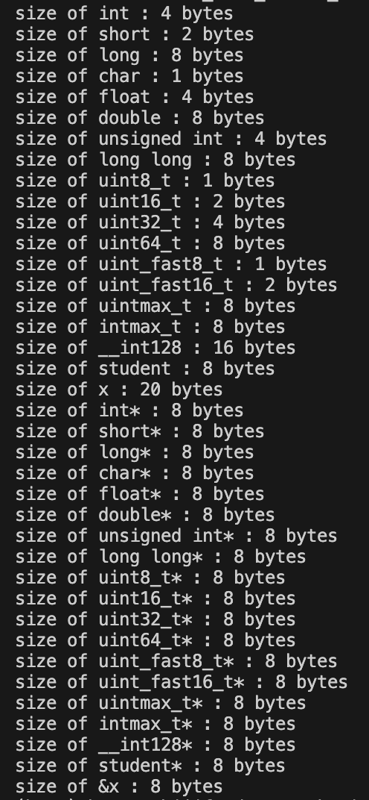


### write-up 4

File swap.c contains the code to swap two integers. Rewrite the swap() function 
using pointers and make appropriate changes in main() function so that the values are 
swapped with a call to swap(). Compile the code with make swap and run the program with 
./swap. Provide your edited code in the writeup. Verify that the results of both sizes.c and 
swap.c are correct by using the python script verifier.py.

我们对swap.c进行修改，通过指针来交换值

```c
// Copyright (c) 2012 MIT License by 6.172 Staff

#include <stdio.h>
#include <stdlib.h>
#include <stdint.h>

void swap(int *i, int *j) {
  int temp = *i;
  *i = *j;
  *j = temp;
}

int main() {
  int k = 1;
  int m = 2;
  int*t_k=&k;
  int*t_m=&m;
  swap(t_k, t_m);
  // What does this print?
  printf("k = %d, m = %d\n", k, m);

  return 0;
}
```

同时我们要修改一下测试脚本，注意到，测试脚本中对于``uint_fast16_t`的大小错误地标注为8，应该为2。
完成修改后运行测试脚本。
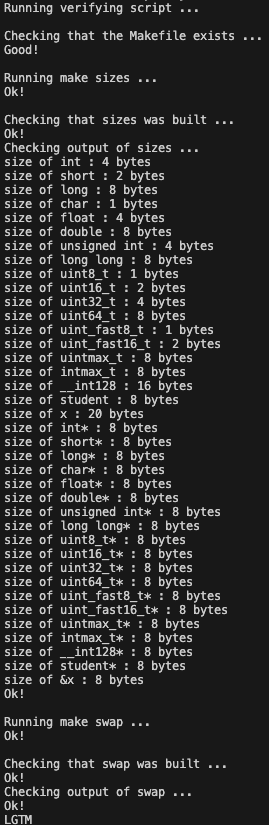
我们通过了size.c和swap.c的测试

### write-up 5

Now, what do you see when you type make clean; make?

运行`make clean`后，终端输出如下
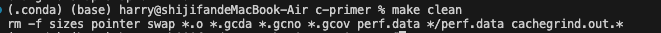
命令删除了如下类型的文件：
- 可执行文件：sizes, pointer, swap：这几个是编译生成的可执行文件。
- 对象文件 (.o)：*.o：编译过程中生成的中间对象文件。
- 覆盖率文件：*.gcda, *.gcno, *.gcov：这些是使用 gcov、gcc 编译时生成的代码覆盖率报告文件。
- 性能分析文件：perf.data 和 */perf.data：这些文件通常是性能分析工具如 perf 生成的。
- valgrind 的分析报告：cachegrind.out.*：这是 valgrind 工具（比如 cachegrind）生成的性能分析报告。

同时我们可以发现本地的这些文件确实被删除

运行`make`后输出如下
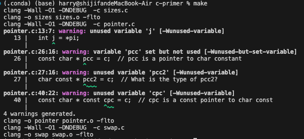
我们可以发现，该命令对`size.c` `pointer.c` `swap.c`这些文件进行了编译和链接，同时也给出我们了警告，我们在`pointer.c`中有声明后未使用的变量，具体如下

1. 编译 sizes.c:
- clang -Wall -O1 -DNDEBUG -c sizes.c：
- -Wall: 启用所有常见的警告，用来提示代码中的潜在问题。
- -O1: 开启一级优化，生成相对高效的代码，但不会牺牲太多编译时间。
- -DNDEBUG: 定义宏 NDEBUG，通常用于禁用断言（assert），使得代码在发布版本中忽略断言检查。
- -c sizes.c: 将 sizes.c 源文件编译为中间的目标文件 sizes.o，但不进行链接。
2.	链接 sizes.o:
- clang -o sizes sizes.o -flto：这一步将之前生成的目标文件 sizes.o 链接生成可执行文件 sizes。
- -o sizes: 指定输出的可执行文件名为 sizes。
- -flto: 启用 Link Time Optimization (LTO)，可以在链接阶段进行跨文件的全局优化，提高程序性能。
3.	编译 pointer.c:
- clang -Wall -O1 -DNDEBUG -c pointer.c：这一步与编译 sizes.c 类似，将 pointer.c 编译为目标文件 pointer.o，并且生成了一些编译警告，提示 pointer.c 文件中的未使用变量。
4.	链接 pointer.o:
- clang -o pointer pointer.o -flto：将 pointer.o 链接生成可执行文件 pointer。
5.	编译 swap.c:
- clang -Wall -O1 -DNDEBUG -c swap.c：编译 swap.c 文件为目标文件 swap.o。
6.	链接 swap.o:
- clang -o swap swap.o -flto：将 swap.o 链接生成可执行文件 swap。

### write-up 6

What output do you see from AddressSanitizer regarding the memory bug? 
Paste it into your writeup here.

我们根据要求运行`make ASAN=1`，得到如下结果
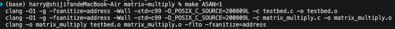

然后我们输入`./matrix_multiply`，得到如下结果
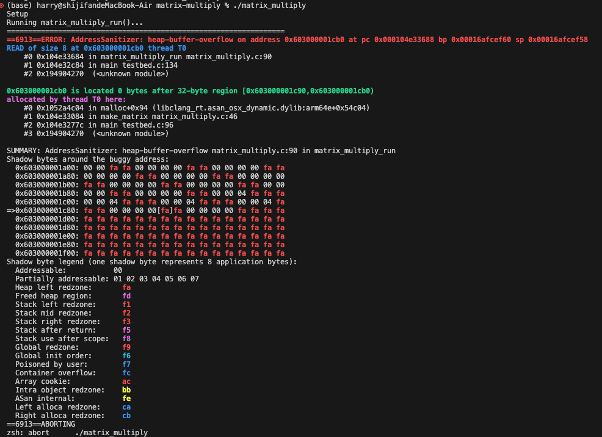
可以看到错误类型是`heap-buffer-overflow`，表示在堆内存中尝试读取超出已分配内存范围的区域。错误发生在 `matrix_multiply.c` 的第 90 行，具体的堆栈跟踪指向了这一行代码。ASAN 显示了在读取地址 `0x603000001cb0` 时发生了越界。我们查看源代码可以发现，由于在代码中没有进行边界检查，如果传入的矩阵 A, B, 和 C 的维度不符合要求，可能会导致访问越界。

例如，如果 C 的行数和列数没有正确分配，执行 C->values[i][j] += ... 可能会访问未分配的内存区域。尤其是，如果 C 的大小没有初始化或分配，可能会导致 heap-buffer-overflow 错误。 

### write-up 7
After you fix your program, run ./matrix_multiply -p. Paste the program
output showing that the matrix multiplication is working correctly.

`matrix_multiply.c`中为矩阵增加初始化，同时修正`testbed.c`中矩阵行列大小的问题，结果如下
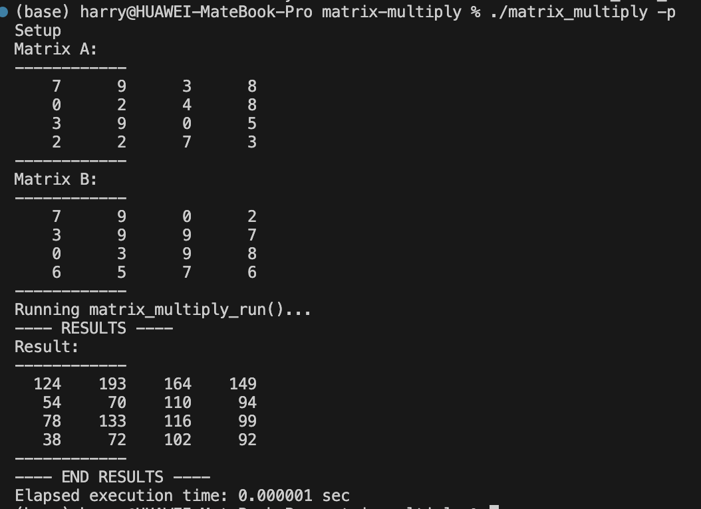

### write-up 8
Paste the output from Valgrind showing that there is no error in your program.

我们在`testbed.c`中添加释放矩阵A，B，C即可
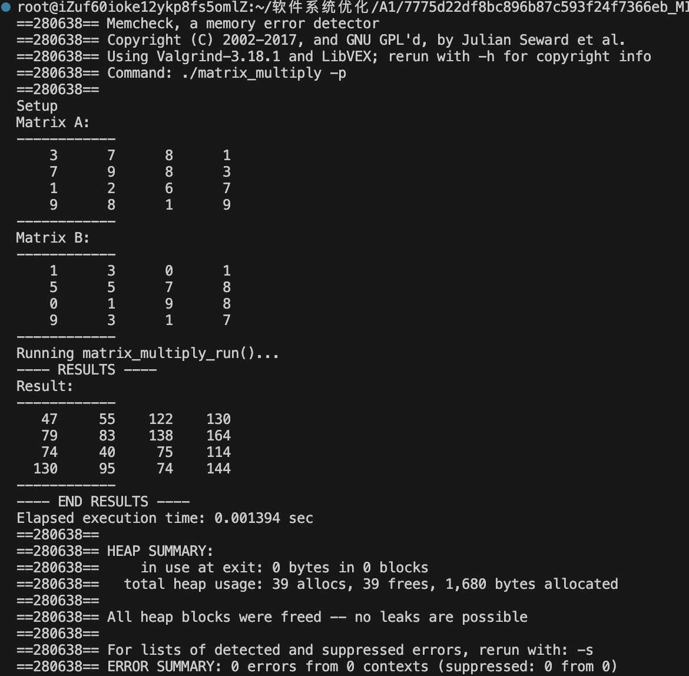