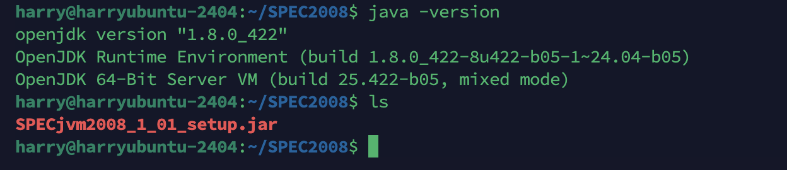
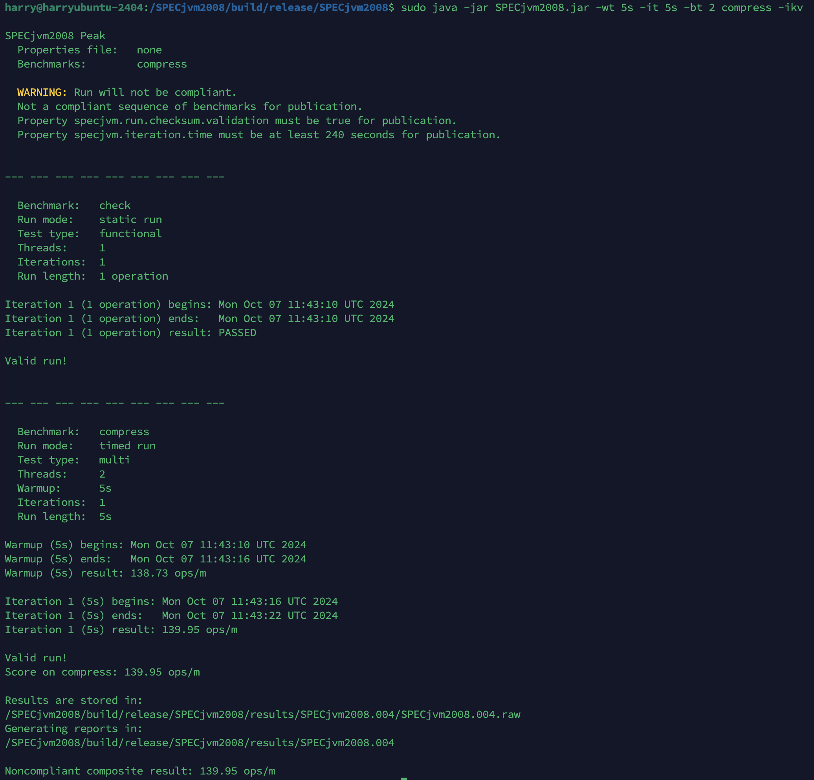
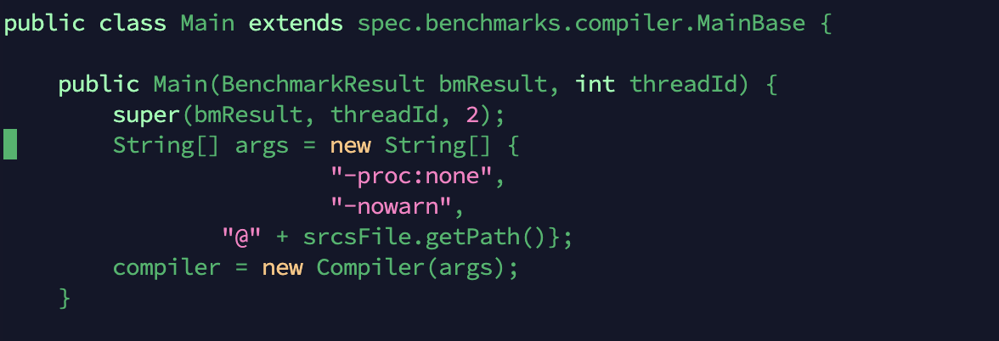
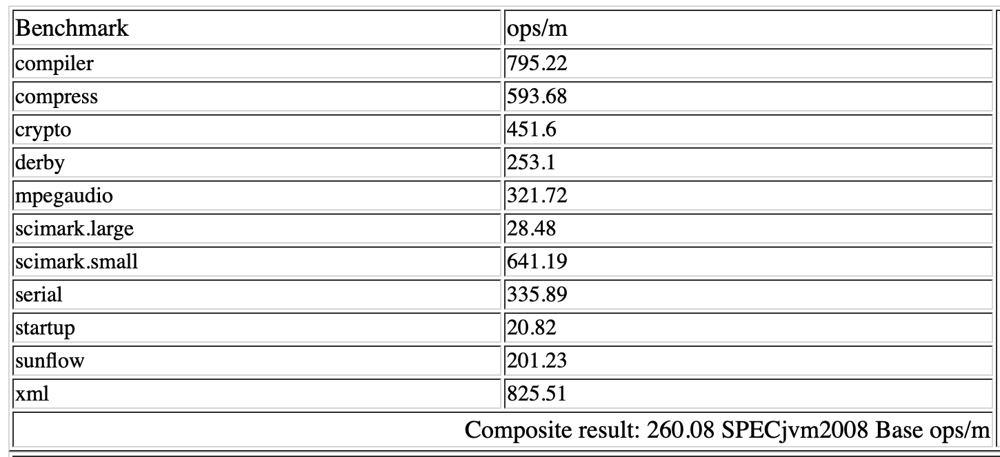
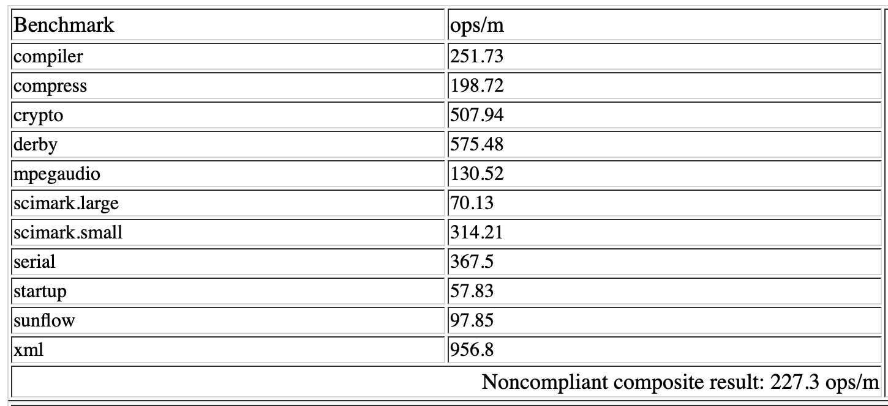
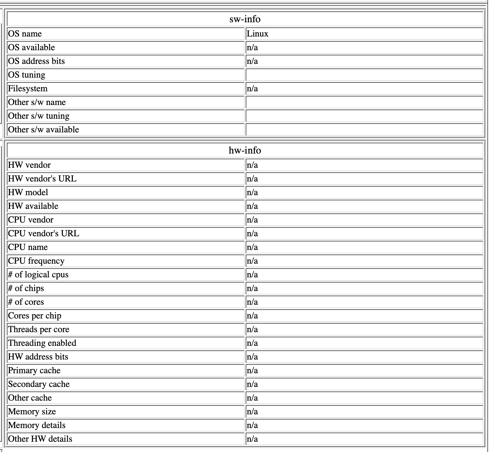

# SPEC2008基准测评

## 1 测试准备工作
我们首先要下载好所需的测试文件和JDK8


## 2 进行测试

### 2.1 SPEC2008 的安装
运行如下指令来进行SPEC2008安装
```shell
java -jar SPECjvm2008_1_01_setup.jar
```
### 2.2 试运行
我们运行如下指令进行试运行
```shell
sudo java -jar SPECjvm2008.jar -wt 5s -it 5s -bt 2 compress -ikv
```
结果如下


### 2.3 正式测试
运行如下指令
```shell
sudo java -jar SPECjvm2008.jar -ikv
```

### startup.compiler.sunflow堵塞

运行时，在`startup.compiler.sunflow`这个项目中发生了堵塞现象，这里我通过查阅资料，得知这个问题应该是SPECjvm2008的一个bug，即父进程重定向了子进程的stderr，但是却没有读取对应的数据，导致一旦出现大量的警告信息时，子进程对stderr的管道写入被堵塞，从而导致测试进程整个被停滞。而上述告警信息主要是因为SPECjvm2008内置的编译器与被测试Java的编译器版本不符。
这里我采用重新编译jvm内核，编译的时候加入-nowarn选项，让javac不输出警告信息，具体操作如下。

1.修改`Main.java`文件

```shell
vim SPECjvm2008/src/spec/benchmarks/compiler/sunflow/Main.java
```

添加参数`-nowarn`即可


2.重新编译jvm
这里需要解压build-tools并执行编译
```shell
cd /SPECjvm2008
unzip build-tools.zip
bash ./build-specjvm.sh
```

编译成功后进入`build/release/SPECjvm2008/`目录进行后续测试即可

## 3 结果分析

### 3.1 项目分析
**首先通过查阅资料，我得知了各项测试的意义**

#### 1. **compiler**

- **描述**：这个测试模拟了Java编译器的工作负载，涉及代码生成和优化。
- **意义**：衡量编译器处理Java源代码并生成字节码的速度。
- **子项**：
  - `compiler.compiler`：编译Java代码的性能。
  - `compiler.sunflow`：特定于Sunflow应用的编译性能。

#### 2. **compress**

- **描述**：这个测试模拟了文件压缩的工作负载，通常涉及大量的I/O操作。
- **意义**：衡量压缩算法执行效率，通常用于备份或存储前的文件处理。
- **子项**：
  - `compress`：文件压缩性能。

#### 3. **crypto**

- **描述**：这个测试包含了多种加密和解密算法，包括AES、RSA和数字签名验证。
- **意义**：衡量加密和解密操作的性能，这对于安全通信非常重要。
- **子项**：
  - `crypto.aes`：高级加密标准（AES）加密性能。
  - `crypto.rsa`：RSA加密性能。
  - `crypto.signverify`：数字签名生成和验证性能。

#### 4. **derby**

- **描述**：这是一个数据库相关的测试，涉及到SQL查询和其他数据库操作。
- **意义**：衡量数据库管理系统的性能，特别是对于嵌入式数据库。
- **子项**：
  - `derby`：Apache Derby数据库性能。

#### 5. **mpegaudio**

- **描述**：这个测试涉及到MPEG音频编码。
- **意义**：衡量音频编码的速度，适用于多媒体应用。
- **子项**：
  - `mpegaudio`：MPEG音频编码性能。

#### 6. **scimark**

- **描述**：这是一个科学计算基准测试，包括FFT（快速傅里叶变换）、LU分解、SOR（Successive Over-Relaxation）、稀疏矩阵乘法和蒙特卡罗方法。
- **意义**：衡量科学计算任务的性能，这些任务通常涉及大量的数值计算。
- **子项**：
  - `scimark.fft.large`：大型FFT性能。
  - `scimark.lu.large`：大型LU分解性能。
  - `scimark.sor.large`：大型SOR性能。
  - `scimark.sparse.large`：大型稀疏矩阵乘法性能。
  - `scimark.monte_carlo`：蒙特卡罗方法性能。
  - `scimark.fft.small`：小型FFT性能。
  - `scimark.lu.small`：小型LU分解性能。
  - `scimark.sor.small`：小型SOR性能。
  - `scimark.sparse.small`：小型稀疏矩阵乘法性能。

#### 7. **serial**

- **描述**：这是一个串行计算的基准测试。
- **意义**：衡量非并行化计算任务的性能。
- **子项**：
  - `serial`：串行计算性能。

#### 8. **startup**

- **描述**：这个测试测量了Java应用程序启动的时间。
- **意义**：衡量应用程序初始化速度，对于频繁启动的应用非常重要。
- **子项**：
  - 各种应用程序的启动性能，如`helloworld`, `compiler`, `compress`, `crypto`, `mpegaudio`, `scimark`, `serial`, `sunflow`, `xml`等。

#### 9. **sunflow**

- **描述**：这是一个渲染引擎相关的测试。
- **意义**：衡量渲染图像的能力，通常用于图形和动画应用。
- **子项**：
  - `sunflow`：Sunflow渲染引擎性能。

#### 10. **xml**

- **描述**：这个测试涉及到XML文档的处理，包括转换和验证。
- **意义**：衡量XML文档处理的性能，适用于Web服务和其他需要解析XML的应用。
- **子项**：
  - `xml.transform`：XML文档转换性能。
  - `xml.validation`：XML文档验证性能。


### 3.2 结果比较
这里我选用了一份SPECjvm2008官网公布的一份报告来做比较

首先展示的是来自官网的一份报告，该机器为`Sun Fire X4450`


`Ubuntu24.04虚拟机`的运行结果如下


通过比较我们可以发现
`Sun Fire X4450`在`compiler`、`compress`、`mpegaudio`、`scimark.small`、`sunflow`项目上得分较高
`Ubuntu24.04虚拟机`在`crypto`、`derby`、`scimark.large`、`serial`、`startup`、`xml`项目上得分较高

根据我们之前的项目作用的分析，可以得到如下结论
`Sun Fire X4450`在编译Java源代码、压缩文件、音频编码、小型的科学计算、图像渲染这几个方面有着更优越的性能

`Ubuntu24.04虚拟机`在加密和解密、数据库管理系统、大型科学计算、串行计算、程序初始化、XML文档处理这些方面有着更优越的性能


由于该虚拟机搭建在`macos`操作系统上部署的`arm架构`的`Ubuntu24.04`，因此由于vmware并没有适配，使得其没用对`CPU`等硬件做出虚拟化，在报告的hw-info中没用显示有效信息


## 4 总结
本次实验我在虚拟中部署了SPECjvm2008并进行了基准测试，我从中了解了如何衡量一台计算机的性能以及一些测试项目是衡量了哪些性能。