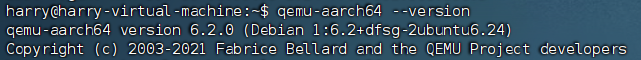
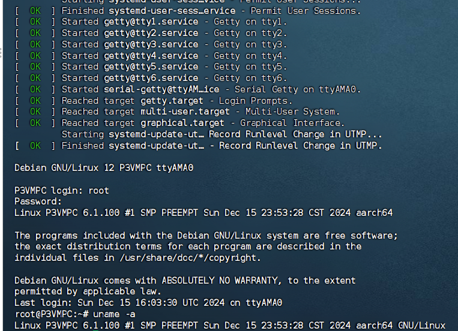
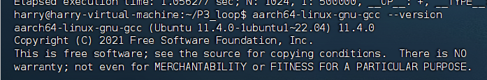
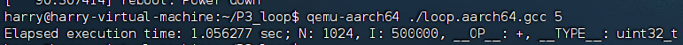
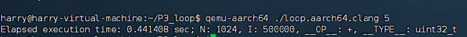
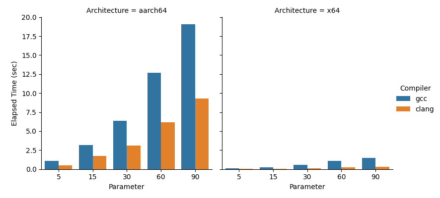
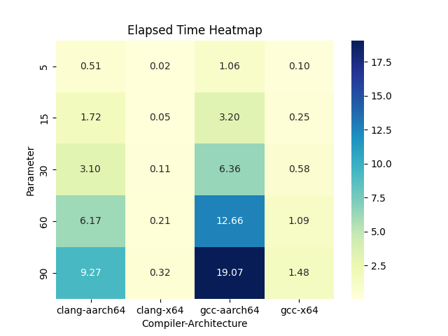
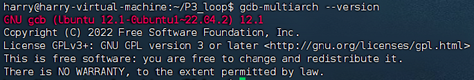
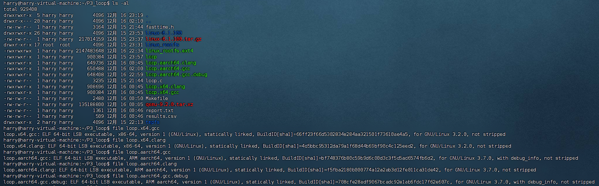

# 实践项目P3：交叉编译和跨平台应用仿真

# 问题1

**在** **Ubuntu** **上安装能够运行** **aarch64 (64-bit ARM ISA)**应用的 **Qemu** **虚拟机**（qemu-aarch64）

## 1.安装***qemu-aarch64***

这里我们首先安装***qemu-aarch64***，这里我通过apt包管理工具来安装，并补全所需的库

```shell
sudo apt install qemu-user qemu-user-static
sudo apt install libc6-arm64-cross
```

接下来我们进行验证



## 2.使用 QEMU 运行完整的 `aarch64` 系统

### 1.根文件系统的制作

我们首先安装需要的工具库

```shell
$ sudo apt-get install debian-archive-keyring bison flex bc build-essential libncurses* libssl-dev
$ sudo apt-get install  qemu-user-static binfmt-support debootstrap
```

这里我要制作的是Debian12的根文件系统，我们用***deboostrap***命令来下载软件包

```shell
$ debootstrap --arch=arm64 --foreign bookworm linux_rootfs http://mirrors.ustc.edu.cn/debian/
```

这里我们指定了架构为arm64，版本代号为bookworm，即Debian12，从ustc源进行下载

接下来使用qemu-aarche64-static来模拟arm64环境的执行环境

```shell
$sudo cp /usr/bin/qemu-aarch64-static /home/harry/linux_rootfs/usr/bin/
```

下面使用debootstrap命令进行软件包的安装和配置

```shell
$ sudo chroot linux_rootfs/ debootstrap/debootstrap --second-stage
```

然后切换到制作好的根文件系统

```shell
$ chroot linux_rootfs/
```

接下来进行基础的设置，包括root密码的修改，host名根据本次实验设置为P3VMPC，网络设置

```shell
$ passwd root
$ echo P3PC > /etc/hostname
$ echo "auto lo" > /etc/network/interfaces
$ echo "iface lo inet loopback" >> /etc/network/interfaces
$ echo "allow-hotplug enp0s1" > /etc/network/interfaces
$ echo "iface enp0s1 inet dhcp" >> /etc/network/interfaces
$ apt update
$ apt install net-tools 
$ exit
```

### 2.制作ext4文件系统

接下来我们来为Qemu虚拟机来制作ext4文件系统，首先用dd命令创建一个image文件并格式化

```shell
$ dd if=/dev/zero of=linux_rootfs.ext4 bs=1M count=2048
$ mkfs.ext4 linux_rootfs.ext4
```

bs=1M表示block大小，count=2048，表示该image大小为2GB

接下来挂载ext4文件系统并拷贝内容

```shell
$ mkdir -p tmpfs
$ sudo mount -t ext4 linux_rootfs.ext4 tmpfs/ -o loop
$ sudo cp -af linux_rootfs/* tmpfs/
$ sudo umount tmpfs
$ sudo chmod 777 linux_rootfs.ext4
```

### 3.编译Linux内核

接下来，我们需要下载Linux内核文件并编译，这里我下载的是6.1.100版本。

```shell
$ cd linux-6.1.100/
$ export ARCH=arm64
$ export CROSS_COMPILE=aarch64-linux-gnu-
$ make defconfig
$ make -j4
```

编译成功后，我们会得到vmlinux和Image文件。

### 4.使用qemu运行arm64的虚拟机

我们在工作目录下执行如下指令

```shell
sudo qemu-system-aarch64 -m 1024 -cpu cortex-a57 -M virt -nographic -smp 4 -kernel linux-6.1.100/arch/arm64/boot/Image -append "noinintrd sched_debug root=/dev/vda rootfstype=ext4 rw crashkernel=256M loglevel=8" -drive if=none,file=linux_rootfs.ext4,id=hd0 -device virtio-blk-device,drive=hd0 
```

 其中：

**-m** 1024 指定内存大小为１Ｇ；

**-cpu**指定了模拟的cpu为 cortex-a57；

**-M machine**选择模拟的机器；

**-nographic**禁止所有的图形输出；

 **-smp 4**指定模拟的系统为４核处理器 ；

**-kernel**指定启动的内核镜像；

 **--append**指定传递的命令行参数；

后面的“**-drive** if=none,file=myrootfs_arm64.ext4,id=hd0 -device virtio-blk-device,drive=hd0”添加根文件系统支持

然后我们用root登录，成功用Qemu搭建了一个arm虚拟机，通过***uname -a***进行验证



# 问题2

**安装** **aarch64** **的** **GCC** **工具链**(gcc-10-aarch64-linux-gnu)

通过apt包管理工具安装

```shell
sudo apt install gcc-10-aarch64-linux-gnu
```

然后验证安装

```shell
aarch64-linux-gnu-gcc --version
```



# 问题3

**用** **aarch64** **的** **GCC** **工 具 链 交 叉 编 译** **loop.c (-O2)** **， 生 成 可 执 行 文 件**loop.aarch64.gcc**，并用**qemu-aarch64 **运行** **loop.aarch64.gcc**

我们将下载好的loop.c进行编译，并运行，这里我们输入的参数为5

```shell
aarch64-linux-gnu-gcc -O2 -static -o loop.aarch64.gcc loop.c
qemu-aarch64 ./loop.aarch64.gcc
```

运行结果如下



# **问题4** 

**用** **clang** **交叉编译** **loop.c(-O2)**，生成可执行文件**loop.aarch64.clang**，并用**qemu-aarch64** **运行** **loop.aarch64.clang**

我们利用clang来进行编译并运行，输入的参数依旧为5

```shell
clang -O2 -static -target aarch64-linux-gnu -o loop.aarch64.clang loop.c
qemu-aarch64 ./loop.aarch64.clang
```

运行结果如下



# 问题5

**用** **qemu-aarch64** **分 别 运 行 前 面 编 译 出 来 的** **loop.aarch64.gcc** 和**loop.aarch64.clang**分别用参数5、15、30、60、90进行测试），记下每次测试的执行时间并以图形方式呈现。

# 问题6

**用**host机器上的gcc和clang分别编译(-O2)出loop.x64.gcc和loop.x64.clang，**并对这两个执行文件分别用参数** 5、15、30、60、90进行测试，记下每次测试的执行时间并以图形方式呈现，进而与前一步**qemu** **仿真测试的结果进行比较。**

问题5问题6这里我放在一起来进行。这里我编写了一个***Makefile***用于批量生成、运行并记录结果

```makefile
# 定义变量
CC_AARCH64_GCC = aarch64-linux-gnu-gcc
CC_AARCH64_CLANG = clang --target=aarch64-linux-gnu
CC_X64_GCC = gcc
CC_X64_CLANG = clang
QEMU_AARCH64 = qemu-aarch64

# 优化级别
OPT_LEVEL = -O2

# 测试参数
TEST_PARAMS = 5 15 30 60 90

# 目标文件
TARGETS = loop.aarch64.gcc loop.aarch64.clang loop.x64.gcc loop.x64.clang

# 默认目标
all: report.txt

# 清理目标
clean:
	rm -f $(TARGETS) report.txt results.csv

# 编译 aarch64 的 gcc 版本
loop.aarch64.gcc: loop.c
	$(CC_AARCH64_GCC) $(OPT_LEVEL) -static -o $@ $<

# 编译 aarch64 的 clang 版本
loop.aarch64.clang: loop.c
	$(CC_AARCH64_CLANG) $(OPT_LEVEL) -static -o $@ $<

# 编译 x64 的 gcc 版本
loop.x64.gcc: loop.c
	$(CC_X64_GCC) $(OPT_LEVEL) -static -o $@ $<

# 编译 x64 的 clang 版本
loop.x64.clang: loop.c
	$(CC_X64_CLANG) $(OPT_LEVEL) -static -o $@ $<

# 运行测试并生成报告
report.txt: $(TARGETS)
	echo "Test Results:" > report.txt
	echo "Parameter,Compiler,Architecture,Elapsed Time (sec)" > results.csv
	for param in $(TEST_PARAMS); do \
		# 运行 aarch64 gcc 版本并记录结果 \
		echo "Running loop.aarch64.gcc with parameter $$param..." >> report.txt; \
		ELAPSED_TIME=$$($(QEMU_AARCH64) ./loop.aarch64.gcc $$param | grep "Elapsed execution time" | awk '{print $$4}'); \
		echo "$$param,gcc,aarch64,$$ELAPSED_TIME" >> results.csv; \
		echo "Result: $$ELAPSED_TIME sec" >> report.txt; \
		# 运行 aarch64 clang 版本并记录结果 \
		echo "Running loop.aarch64.clang with parameter $$param..." >> report.txt; \
		ELAPSED_TIME=$$($(QEMU_AARCH64) ./loop.aarch64.clang $$param | grep "Elapsed execution time" | awk '{print $$4}'); \
		echo "$$param,clang,aarch64,$$ELAPSED_TIME" >> results.csv; \
		echo "Result: $$ELAPSED_TIME sec" >> report.txt; \
		# 运行 x64 gcc 版本并记录结果 \
		echo "Running loop.x64.gcc with parameter $$param..." >> report.txt; \
		ELAPSED_TIME=$$(./loop.x64.gcc $$param | grep "Elapsed execution time" | awk '{print $$4}'); \
		echo "$$param,gcc,x64,$$ELAPSED_TIME" >> results.csv; \
		echo "Result: $$ELAPSED_TIME sec" >> report.txt; \
		# 运行 x64 clang 版本并记录结果 \
		echo "Running loop.x64.clang with parameter $$param..." >> report.txt; \
		ELAPSED_TIME=$$(./loop.x64.clang $$param | grep "Elapsed execution time" | awk '{print $$4}'); \
		echo "$$param,clang,x64,$$ELAPSED_TIME" >> results.csv; \
		echo "Result: $$ELAPSED_TIME sec" >> report.txt; \
	done
	echo "Results saved to results.csv" >> report.txt
```

最终将结果进行可视化，这里我绘制了两张，分别为分面图和热力图





## 我们可以根据结果得到如下结论

- `clang` 的耗时显著低于 `gcc`。
- `aarch64` 交叉编译版本的耗时显著高于原生 `x64` 版本。
- 随着 `Parameter` 的增加，耗时近似呈线性增长。

# 问题7

**安装支持多** **ISA** **的** **gdb** **调试器（**gdb-multiarch）

我们可以通过apt包管理工具进行安装

```shell
sudo apt install gdb-multiarch
```

并通过如下指令验证

```shell
gdb-multiarch --version
```



# 问题8

**用** **gdb-multiarch** **结合** **qemu-aarch64** **对** **loop.aarch64.gcc.debug** **进行源码级调试**

我们首先编译生成带调试信息的 loop.aarch64.gcc.debug

```shell
aarch64-linux-gnu-gcc -static -g -o loop.aarch64.gcc.debug loop.c
```

接下来我们将loop.aarch64.gcc.debug以调试模式运行在本地端口上

```shell
qemu-aarch64 -g 1235 ./loop.aarch64.gcc.debug
```

我们再开启一个终端进行连接

```shell
gdb-multiarch ./loop.aarch64.gcc.debug
target remote localhost:1235
```

接下来就可以进行调试了


# 附录：工作目录截图

